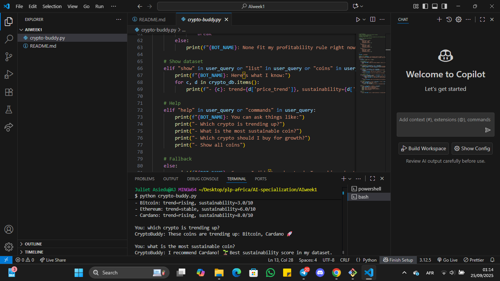

# CryptoBuddy — Rule-based Cryptocurrency Advisor Chatbot

**Theme:** Your First AI-Powered Financial Sidekick! 🌟  
**Course:** AI for SE Specialization — Week 1 Assignment  

## 📌 Description
CryptoBuddy is a simple **rule-based chatbot** that recommends cryptocurrencies based on **profitability** (price trends and market cap) and **sustainability** (energy use and sustainability score).  

This project demonstrates how **if-else rules** can mimic AI-style decision-making.  

## 🚀 Features
- Answers queries about:
  - Most sustainable crypto 🌱  
  - Trending coins 🚀  
  - Long-term growth/profitability 📈  
- Displays dataset information  
- Provides friendly interaction tone  

## 🛠️ Tools
- Language: Python  
- Platform: VS Code (can also run in Colab/Jupyter)  
- No external libraries required  

## ▶️ How to Run
1. Clone this repo:
   ```bash
   git clone https://github.com/AJ-254/AI-for-SE-week1.git
   cd AI-for-SE-week1

---

## Example Queries:
1. Which crypto is trending up?  
2. What’s the most sustainable coin?  
3. Show all coins  

---

## ⚠️ Disclaimer
This is educational only. **Not financial advice.**  
Crypto is risky — always do your own research.  

---

## 📸 Screenshots


---

## Author
👩‍💻 **Juliet Asiedu**  
